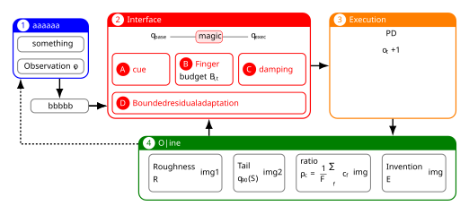

# 一个复杂的流程图

## SVG



## LaTeX

使用`minipage`套`tcolorbox`，结合`tikz`绘制箭头。

```latex
\documentclass[border=14pt, varwidth=25cm]{standalone}
\usepackage{ctex}
\usepackage{graphicx}
\usepackage[most]{tcolorbox}
\usepackage{pgfplots}
\usepackage{amsmath}
\usepackage{amssymb}
\usepackage{multirow}
\usepackage{xcolor}
\usepackage{varwidth}
\usetikzlibrary{positioning, arrows.meta, calc, tikzmark}

\colorlet{darkgreen}{green!50!black}
\graphicspath{{./figures/}}

% 一个圆圈文字
\newcommand{\circledtext}[3]{%
  \tikz[baseline=(X.base)]{%
    \node[circle, draw=none, fill=#2, inner sep=2pt] (X) {%
      \textcolor{#1}{#3}%
    };%
  }%
}

\begin{document}
\small

\tikzset{
  my arrow/.style={->, >={Latex[scale=1.2]}, line width=1.4pt}
}
% 1. 全局样式定义
\tcbset{
  my flex/.style={
    enhanced,
    % nobeforeafter,       % 取消前后间距
    % hbox,                % 宽度由内部内容决定
    arc=8pt,
    boxrule=1.2pt,
    colback=#1!0,
    colframe=#1,
    fonttitle=\bfseries,
    boxsep=0pt, top=4pt, bottom=4pt, left=4pt, right=4pt
  },
  % 子盒子专用样式
  sub flex/.style={
    enhanced,
    % nobeforeafter,
    % hbox,
    arc=4pt,             % 子盒子圆角小一点
    boxrule=1pt,
    colback=#1!0,
    colframe=#1, % !80
    fonttitle=\small\bfseries,
    center title,
    % halign=center,       % 内部文字水平居中
    valign=center,
    % 稍微收紧子盒子的内边距
    boxsep=0pt, top=4pt, bottom=4pt, left=4pt, right=4pt
  },
  my flex/.default=gray,
  sub flex/.default=gray
}

\begin{flushright}
  \begin{minipage}{3.0cm}
    \begin{flushright}
      \begin{tcolorbox}[
          my flex=blue,
          % equal height group=A,% 父盒子：这一排A盒子强制等高
          title=\circledtext{blue}{white}{1} aaaaaa,
          remember as=box1
        ]
        \begin{tcolorbox}[
            sub flex=gray,
          ]
          \centering

          something

        \end{tcolorbox}
        \begin{tcolorbox}[
            sub flex=gray,
          ]
          \centering
          Observation $o_t$
        \end{tcolorbox}
      \end{tcolorbox}%

      \vspace{0.5cm}
      \begin{minipage}{2.3cm}
        \begin{tcolorbox}[
            sub flex=gray,
            remember as=oap
          ]
          \centering

          bbbbb

        \end{tcolorbox}
      \end{minipage}
    \end{flushright}
  \end{minipage}
  \hspace{0.5cm}
  \begin{minipage}{8.0cm}
    \begin{tcolorbox}[
        my flex=red,
        title=\circledtext{red}{white}{2} Interface,
        remember as=box2,
        equal height group=box,
      ]
      \begin{center}
        \begin{tikzpicture}
          \node[] (qbase) {$q_{\text{base}}$};
          \node[right=of qbase, draw=red, fill=red!10, rounded
          corners] (magic) {magic};
          \node[right=of magic] (qexec) {$q_{\text{exec}}$};
          \draw[] (qbase) -- (magic);
          \draw[] (magic) -- (qexec);
        \end{tikzpicture}
      \end{center}

      \begin{minipage}{0.3\linewidth}
        \begin{tcolorbox}[
            sub flex=red,
            equal height group=DI1
          ]
          \textcolor{red}{\circledtext{white}{red}{A}
          \bfseries cue}

        \end{tcolorbox}
      \end{minipage}\hfill
      \begin{minipage}{0.3\linewidth}
        \begin{tcolorbox}[
            sub flex=red,
            equal height group=DI1
          ]
          \textcolor{red}{\circledtext{white}{red}{B}
            \bfseries Finger
          }

          budget $B_{i,t}$
        \end{tcolorbox}
      \end{minipage}\hfill
      \begin{minipage}{0.35\linewidth}
        \begin{tcolorbox}[
            sub flex=red,
            equal height group=DI1
          ]
          \textcolor{red}{\circledtext{white}{red}{C}
            \bfseries  damping
          }

        \end{tcolorbox}
      \end{minipage}
      \begin{tcolorbox}[
          sub flex=red,
        ]
        \begin{minipage}{12cm}
          \textcolor{red}{\circledtext{white}{red}{D}
            \bfseries Bounded residual adaptation
          }
        \end{minipage}
      \end{tcolorbox}
    \end{tcolorbox}%
  \end{minipage}
  \hspace{0.5cm}
  \begin{minipage}{5.0cm}
    \begin{tcolorbox}[
        my flex=orange,
        title=\circledtext{orange}{white}{3} Execution,
        remember as=box3,
        equal height group=box,
      ]
      \centering
      {\bfseries PD}

      \vspace{0.5em}

      $o_t+1$
    \end{tcolorbox}
  \end{minipage}

  \vspace{2em}
  \begin{minipage}{12.5cm}
    \begin{tcolorbox}[
        my flex=darkgreen,
        title=\circledtext{darkgreen}{white}{4} Offline,
        remember as=box4
      ]
      % 下面两个是最大宽度，不是实际宽度
      \newcommand{\maxTextWidth}{8cm}
      \newcommand{\maxImgWidth}{8cm}
      \centering
      \begin{tabular}{@{}cccc@{}}
        \begin{tcolorbox}[
            sub flex=gray,
            remember as=sub1,
            hbox,
            equal height group=PAOF,
          ]
          \begin{varwidth}{\maxTextWidth}
            {\bfseries Roughness}

            $R$
          \end{varwidth}
          \begin{varwidth}{\maxImgWidth}
            img1
            %\includegraphics{}
          \end{varwidth}
        \end{tcolorbox} &
        \begin{tcolorbox}[
            sub flex=gray,
            remember as=sub2,
            hbox,
            equal height group=PAOF
          ]
          \begin{varwidth}{\maxTextWidth}
            {\bfseries Tail}

            $q_{90}(S)$
          \end{varwidth}
          \begin{varwidth}{\maxImgWidth}
            img2
          \end{varwidth}
        \end{tcolorbox} &
        \begin{tcolorbox}[
            sub flex=gray,
            remember as=sub2,
            hbox,
            equal height group=PAOF
          ]
          \begin{varwidth}{\maxTextWidth}
            {\bfseries ratio}

            $\displaystyle \rho_c = \frac1F \sum_f c_f$
          \end{varwidth}
          \begin{varwidth}{\maxImgWidth}
            img
          \end{varwidth}
        \end{tcolorbox} &
        \begin{tcolorbox}[
            sub flex=gray,
            remember as=sub2,
            hbox,
            equal height group=PAOF
          ]
          \begin{varwidth}{\maxTextWidth}
            {\bfseries Invention}

            $E$
          \end{varwidth}
          \begin{varwidth}{\maxImgWidth}
            img
          \end{varwidth}
        \end{tcolorbox}
      \end{tabular}
    \end{tcolorbox}
  \end{minipage}
\end{flushright}

\begin{tikzpicture}[
    remember picture, overlay,
  ]
  \draw[my arrow] (oap.north |- box1.south) -- (oap.north);
  \draw[my arrow] (oap.east) -- (box2.west |- oap.east);
  \draw[my arrow] (oap.east) -- (box2.west |- oap.east);
  \draw[my arrow] (box2.east) -- (box3.west);
  \draw[my arrow] (box3.south) -- (box3.south |- box4.north);
  \draw[my arrow] (box2.south |- box4.north) -- (box2.south);
  \coordinate (box41mid) at ([xshift=1em, yshift=-1em]box1.west |- box4.north);
  \draw[my arrow, dashed]
  (box4.west |- box41mid) --
  (box41mid) --
  (box41mid |- box1.south);
\end{tikzpicture}
\end{document}
```
