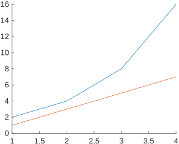
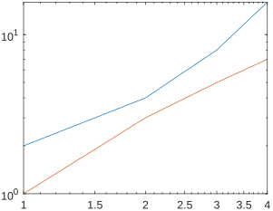

# MATLAB 调用 loglog 函数绘图但图像却没有使用对数坐标轴

可能是`figure`和`hold on`的原因。

## 错误范例：

```matlab
x = [1 2 3 4];
y = [2 4 8 16];
z = [1 3 5 7];

figure;
hold on
loglog(x, y);
loglog(x, z);
```

输出



## 正确范例：

注意`hold on`的位置：

```matlab
x = [1 2 3 4];
y = [2 4 8 16];
z = [1 3 5 7];

figure;
loglog(x, y);
hold on
loglog(x, z);
```

输出



## 为什么？

我也不知道……

似乎在创建了`figure`后直接调用`hold on`就会这样。