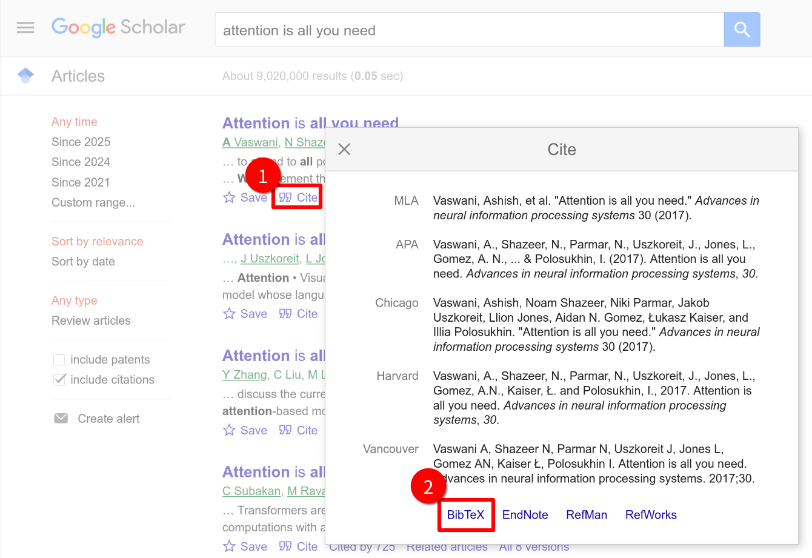

# 在LaTeX中添加参考文献

> BibTeX是一套用于管理文献、产生文献目录的格式。 使用上通常与LaTeX一起使用。(摘自[WikiPedia](https://zh.wikipedia.org/zh-cn/BibTeX))

## 0. 内容与格式的分离

在 Word 中，你手动写下“[1] 王小明. 论文标题...”，一旦要调整格式（比如要把作者变斜体，或者按年份排序），你需要手动修改几十处。而LaTeX的逻辑是数据库思维：

1. **`.bib` 文件（数据库）：** 只管存储数据（作者是谁、哪年发的），不关心长什么样。
2. **`.tex` 文件（逻辑）：** 只管引用数据（这里引用了这篇文章），不关心具体内容。
3. **样式命令（渲染）：** 决定最终长什么样（是 `[1]` 还是 `(Wang, 2025)`）。

有了BibTeX，我们可以方便的在一个文件中收集需要的文献，并在LaTeX文件中引用它。

## 1. 创建包含参考文献条目 `.bib` 文件

首先，我们需要创建一个后缀为 `.bib` 的文件（例如 `references.bib`），并在其中添加参考文献条目。每个参考文献条目都需要遵循BibTeX格式，通常包括如作者、标题、出版年份等信息。

一个bib文件中可以包含多个条目，下面我们来看一下一个典型的参考文献条目格式是怎么样的：

```bibtex
@book{latexguide,
    author    = {Leslie Lamport},
    title     = {LaTeX: A Document Preparation System},
    publisher = {Addison-Wesley},
    year      = {2077},
    edition   = {2nd}
}
```

让我们逐字段介绍一下这个格式：

```
 @标志一个条目的开始
 │                                                          
 │   文档类型                                     
 │   固定语法: book, article...                                 
 │   │                                                      
 │   │      引用标签                             
 │   │      自定义ID: 在正文中引用                                   
 │   │      │                                               
┌┴┐┌─┴──┐ ┌─┴──────────┐                                    
│@││book│{│ latexguide │,                                   
└─┘└────┘ └────────────┘                                    
     字段名 (Field Name)                                       
     固定关键字: author, title...                                
     │                                                      
     │             字段内容                       
     │             具体的文献信息                                  
   ┌─┴────┐      ┌─┴──────────────┐                         
   │author│   = {│ Leslie Lamport │}, ◄────── 注意：字段结束必须加英文逗号
   └──────┘      └────────────────┘                         
    title     = {LaTeX: A Document Preparation System},     
    publisher = {Addiso.-Wesley},                           
    year      = {2077},                                     
    edition   = {2nd}                                       
    ...                                                     
       ◄────── 可以添加更多字段，
               字段的顺序不影响编译的效果
    ...                                                     
 }                                                          
```

例如，我们在与`.tex`文件相同的目录下创建一个 `references.bib` 文件，包含两个条目的示例内容如下：

```bibtex
@book{latexguide,
  author    = {Leslie Lamport},
  title     = {LaTeX: A Document Preparation System},
  publisher = {Publisher},
  year      = {2077},
  edition   = {2nd},
}

@misc{citename,
  author  = {chenyu76},
  title   = {Add citation in LaTeX},
  year    = {2025}
}
```

可以在一个文件中添加任意多的条目，默认情况下，只有在正文中使用`\cite`命令引用的条目，才会出现在最后编译好的文档中。

每个`@`开头是一个条目，条目内部填入作者、标题等信息；这个示例中第一个条目中book是文档类型， 此外还有article, inproceedings, misc等，如它们的名称所暗示的，它们分别代表书籍、文章等格式；`latexguide`是引用时使用的名称，可以在之后使用类似的格式添加更多内容。对于正经期刊上发表的论文，其对应的bib条目一般可以直接在[Google Scholar](https://scholar.google.com/)或其他文献网站上复制获得，不推荐手写；或者你非常懒的话，也可以让AI生成，但务必注意核对信息。



## 2. 引用参考文献

在LaTeX文件中，使用 `\cite{}` 命令引用参考文献。例如：

```latex
This is a reference to the LaTeX guide \cite{latexguide}.
```

这里的`latexguide`是上面的例子中定义的引用标签。

## 3. 插入参考文献列表

在文档任意位置插入使用的参考文献列表（通常是文末，`\end{document}`前）。只有使用了`\cite{}`命令插入的文献才会出现。

使用 `\bibliographystyle{}` 命令指定参考文献的格式，并使用 `\bibliography{}` 命令指定 `.bib` 文件的路径。在编译好的文档中，参考文献列表会出现在`\bibliography{}`命令调用处。

```latex
\bibliographystyle{plain}  % 参考文献的样式
\bibliography{references.bib}  % 引用.bib文件
```

> [!IMPORTANT]
> 在这个示例中，我们之前创建的`references.bib`与`.tex`文件位于同一目录，所以可以直接使用`\bibliography{references.bib}`引用bib文件。但是如果bib文件与tex文件不在同一个目录下，就需要在`{ }`内填写其位置。

### 常用样式一览

修改 `\bibliographystyle{...}` 中的参数，可以瞬间改变所有文献的格式：

| 样式代码 | 排序方式               | 显示效果 (正文 / 列表)           |
| -------- | ---------------------- | -------------------------------- |
| `plain`  | 按作者姓名首字母排序   | `[1]` / `[1] Lamport...`         |
| `unsrt`  | 按在文中出现的先后排序 | `[1]` / `[1] Lamport...`         |
| `alpha`  | 字母+年份排序          | `[Lam77]` / `[Lam77] Lamport...` |
| `abbrv`  | 类似 plain，但简写名字 | `[1]` / `[1] L. Lamport...`      |

### Tips

1. 如果在beamer中使用，可以添加 allowframebreaks 参数使文献列表自动换页。

```latex
\begin{frame}[allowframebreaks]{References}
	\bibliographystyle{plain}
	\bibliography{references}
\end{frame}
```

beamer默认使用图标而不是`[1], [2]`样式的编号，可以使用下面命令给文献列表编号。

```
\setbeamertemplate{bibliography item}{\insertbiblabel}
```

2. 可以通过使用`hyperref`宏包使引用标签可点击。

```latex
\usepackage{hyperref}
% 可以使用`[hidelinks]`选项隐藏pdf中的红色框框
%\usepackage[hidelinks]{hyperref}
```

3. 多个作者怎么写不要用逗号分隔。
   - 不要用逗号分隔作者！必须用 `and` 连接。
   - 错误：`author = {San Zhang, Si Li}`
   - 正确：`author = {San Zhang and Si Li}` (BibTeX 会自动处理成 "S. Zhang, S. Li" 等格式)。
4. 参考文献列表里只有一部分文献？
   - BibTeX 默认只显示被引用的文献。如果你想显示数据库里的所有文献（包括没引用的），请在 `\bibliography` 前加上 `\nocite{*}`。

## 4. 完整示例

```latex
\documentclass{article}

\begin{document}

This is a reference to the LaTeX guide \cite{latexguide}.

\bibliographystyle{plain}  % 选择参考文献的格式
\bibliography{references.bib}  % 引用.bib文件

\end{document}
```

你可以在[这里](./Add-citation-in-LaTeX.zip)下载这个示例。

## 5. 编译流程

在 LaTeX 中正确处理参考文献通常需要编译 4 次。如果你使用 Overleaf，它会自动处理；但在本地使用命令行或编辑器时，了解原理很重要。

### 为什么需要这么多次？

LaTeX 处理参考文献不是一次性完成的，它需要一个“信使”—— **.aux (辅助) 文件**。

1. **`xelatex` (第1遍 - 抄录)**：LaTeX 读一遍正文，看到 `\cite{latexguide}`，它在 `.aux` 小本本上记下：“这里引用了 `latexguide`”。此时文档中显示为 `[?]`。
2. **`bibtex` (第2遍 - 搬运)**：BibTeX 程序读取 `.aux`，去 `.bib` 数据库里找对应条目，按样式整理好，生成 `.bbl` 文件（真正的列表代码）。
3. **`xelatex` (第3遍 - 插入)**：LaTeX 读取 `.bbl` 文件，把参考文献列表排版到文末。
4. **`xelatex` (第4遍 - 链接)**：LaTeX 终于确认了每一篇文献的最终编号（如 [1]），将正文中的 `[?]` 替换为正确的 `[1]`。

**命令行操作示例：**

```bash
xelatex yourfile.tex
bibtex yourfile.aux   # 注意这里是对 .aux 文件运行 bibtex
xelatex yourfile.tex
xelatex yourfile.tex
```

> [!TIP]
> 如果你只修改了正文文字，只需运行一遍 xelatex；只有当你**新增/删除引用**或**修改了 bib 文件**时，才需要完整跑这一套流程。

2025/02/20
