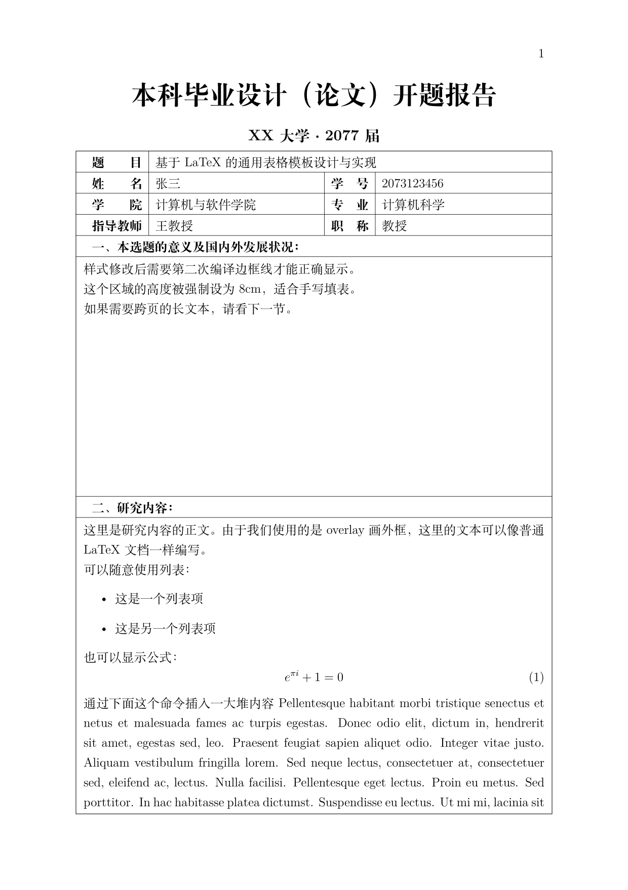
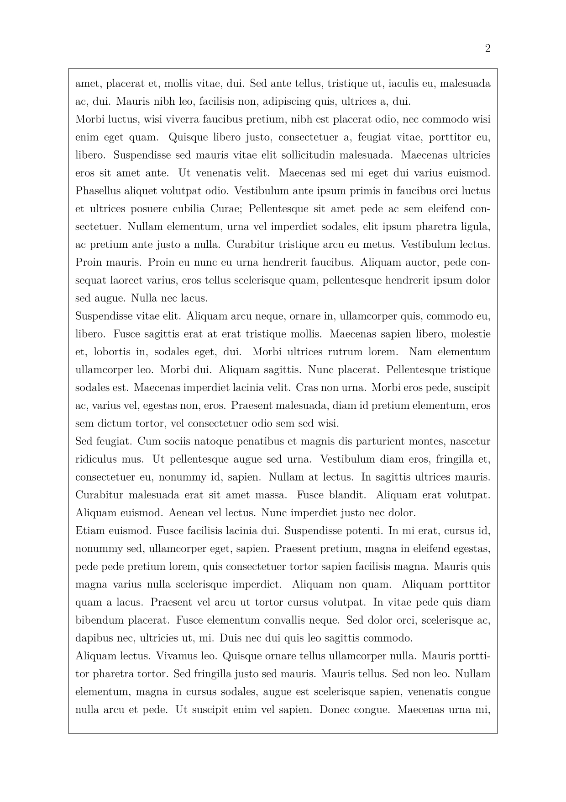
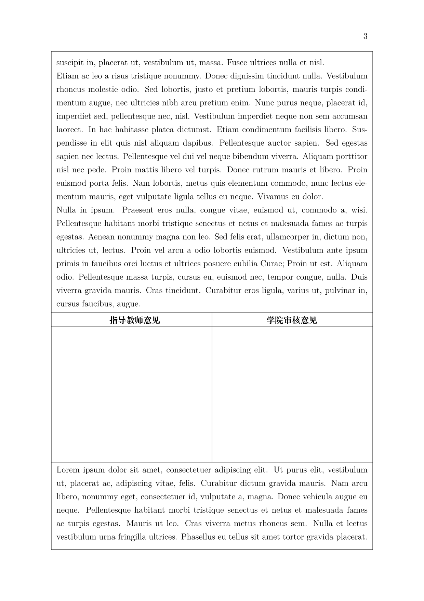
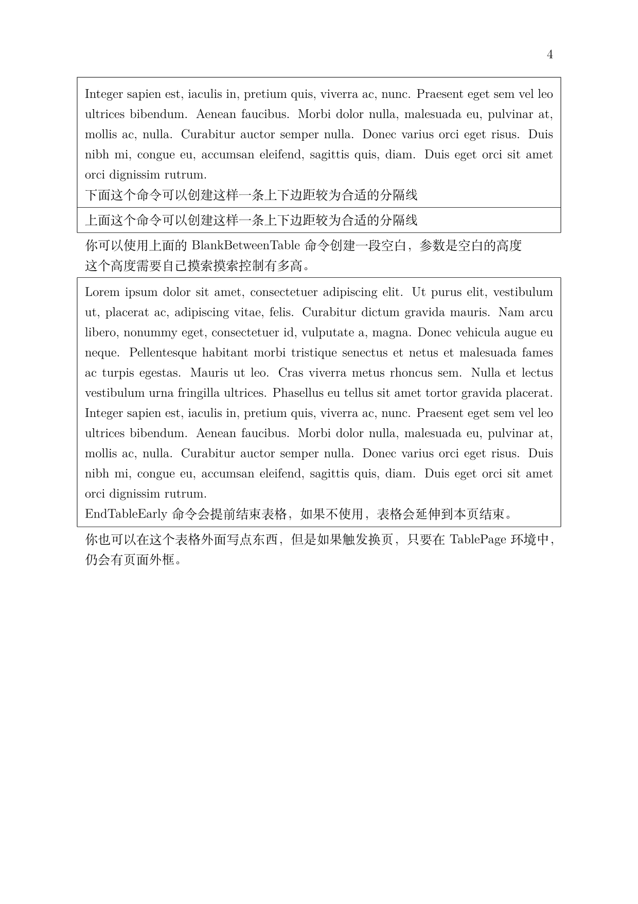

# 那些由一个又一个表格组成的Word文档

在经过本科几年与这些超级表格文档的“抗争”后，我终于实现了一个[比较满意的LaTeX解决方案](https://github.com/chenyu76/deans-Office-LaTeX)，可以比较方便的创建类似的文档。

由于不是很会用Word，特别是当遇到公式、引用、参考文献的复杂问题时，我总是希望使用LaTeX完成工作，但是学校的文档总是只有Word模板提供，并且这些Word文档里面总是由一个超大的表格构成，然而LaTeX并不能很好的实现这一点。在这几年的摸索中，我逐渐找到了一个还算可以的方案，并最终在写毕设的开题报告时将其实现了出来。可喜可贺，可喜可贺。

下面来看看这个模板的效果：

2025/12/7
