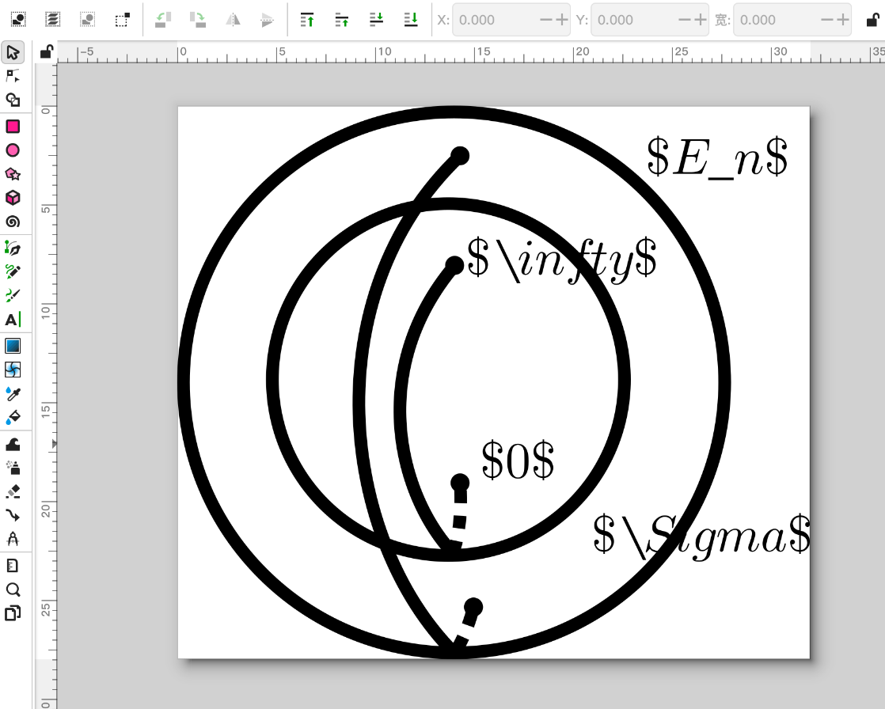
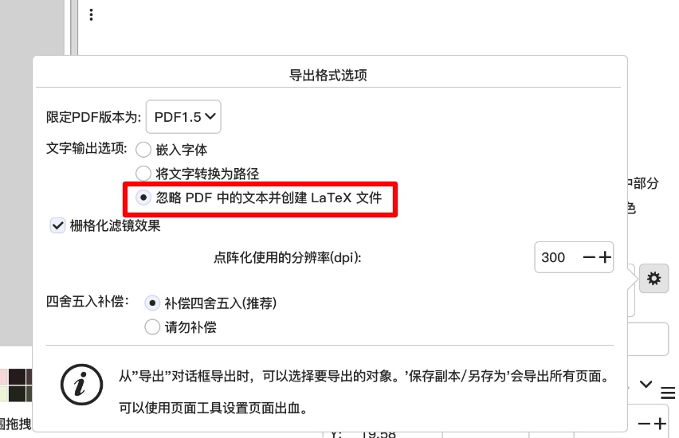
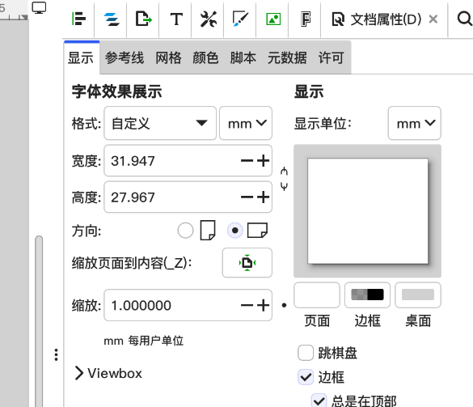

# 使用Inkscape给LaTeX文档绘图时在其中插入公式

[Inkscape](https://inkscape.org/)是矢量图形编辑器，以自由软件许可发布与使用。该软件的开发目标是成为强大的绘图软件，且能完全遵循与支持XML、SVG及CSS等开放性的标准格式。

## 1.Inkscape中插入文本时直接使用LaTeX格式

像这样：



文字的大小与字体在导出时会被忽略，文字内容将会直接交给LaTeX处理，最后呈现的内容将与LaTeX中输入同样内容所编译出来的文字效果相同。因此你可以直接输入任何LaTeX代码。

## 2. 导出PDF

在Inkscape中选择导出，格式选择PDF，并使用“忽略PDF中的文本并创建LaTeX文件”选项。



## 3. 在LaTeX插入绘制好的文件

Inkscape会在你选择的路径下生成一个与pdf名称相同的`.pdf_tex`文件，将这个文件和pdf一起移动到你的LaTeX代码能访问到地方，然后使用

```latex
\input{<filename>.pdf_tex}
```

插入绘制好的图片。（如有需要，你也可以在外围套上figure环境并附上`\caption`）

### 导出效果一例


## 注意事项

### 宏包要求

导言区需要包含以下两个宏包：

```latex
\usepackage{xcolor}
\usepackage{graphicx}
```

### 路径要求

如果`.pdf`文件和`.pdf_tex`不与编译使用的`.tex`在同一目录下，需要包含以下宏包：
```latex
\usepackage{import}
```
并使用
```latex
\import{<path to file>}{<filename>.pdf_tex}
```
而不是
```latex
\input{<filename>.pdf_tex}
```
插入图片。

### 缩放图片

默认情况下，插入的图片大小与inkscape中定义的文档属性大小相同：



如果需要缩放图片，使用
```latex
\def\svgwidth{<desired width>}
\input{<filename>.pdf_tex}
```
注意，图片中的文本大小不会随绘图元素的缩放而缩放。如果你不希望如此，使用
```latex
\resizebox{<desired width>}{!}{\input{<filename>.pdf_75mmtex}}
```
代替。


For more information, please see info/svg-inkscape on [CTAN](https://ctan.org/tex-archive/info/svg-inkscape?lang=en):


2025/03/11