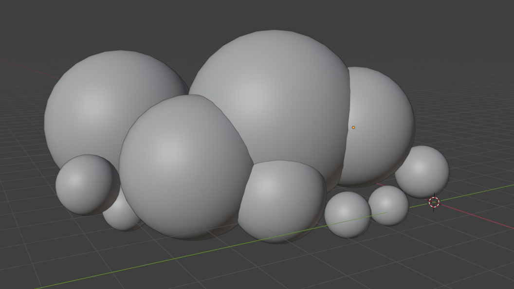
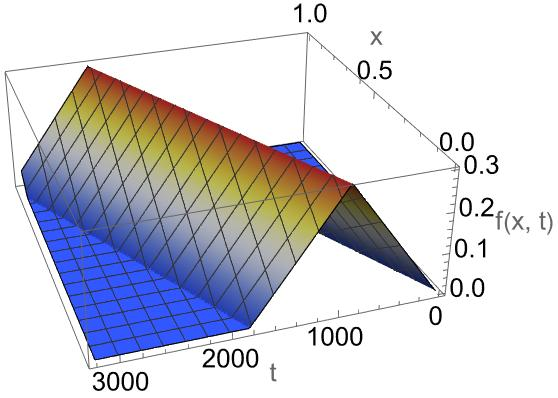

# 新年新主题！

新的一年，给网站换了一个新的风格！

背景天空会根据时间变换颜色和风格，白天有☁️，晚上有✨和🌠。
在[这里](/img/pixelart/index.html)有全屏的版本。

## 一些有趣的技术细节

- 图片完全由程序生成，没有一点二进制文件
- 云是通过绘制3D球体渲染出来的
- 背景的棋盘抖动颜色是看《16bit的感动》学的（虽然动画改的剧情不好看）
- 晚上的星星和流星全是div
- 其他细节请看js源文件
- 最近可以预定天子的FUMO,感兴趣的快去下单吧！

## 网页内容终于不是在客户端处理的了！

- python脚本换成了node.js在Github上先编译好。

## 稍微详细一点的实现

### 背景天空

- 就是一堆div矩形！
- 还有根据剩余类填充颜色的棋盘格纹理（使用了canvas）！

### 云

当一堆球球层层叠叠堆在一起时，长得就像云了，像这样：



所以在javascript中，我们只要做一个基础的3D渲染，实现

1. 通过正态分布随机原点和半径，创建几十个球体
2. 指定摄像机方向，计算球体重叠
3. 指定光线方向，计算球面的法向与光线的点积
4. 根据点积大小使用不同抖色填充：从亮到暗：白色 $\to$ 加亮的天空色 $\to$ 加深的天空色

就好了。

当然，随机的参数需要试多几次才能找到一个比较好的。

### 星星

在随机位置一大堆白色方块div，注意位置与网格对齐，然后通过css动画就能一闪一闪啦。

### 草

这叫蒲苇吗，我不是很清楚，Google识图告诉我它叫蒲苇。不要紧的，画出来长得像什么我们曾经见过的植物就好 :)

这种草可以近似为一根竖的弯曲棒子和很多条长在上面的倾斜向上的弯曲棒子，那么就可以建立模型。

如果我们忽略长在上面的弯曲棒子的自重，~~那么我们在小学二年级的时候就学过~~ 我物理不好没学过，但是AI告诉我，一根底端垂直细杆受自身重力影响弯曲时的形状是个抛物线

$$
x = y^2.
$$

同样也是AI告诉我，末端固定的横向棒子的形状这么个复杂的四次多项式

$$
y(x) = \frac{q}{24EI} \left( x^4 - 4Lx^3 + 6L^2x^2 \right) + k x.
$$

该式描述了匀质悬臂梁在自重作用下的挠度曲线。其中杆长为 $L$ ，抗弯刚度为 $EI$ ，均布载荷集度 $q = \rho g A$ （其中 $\rho$ 为材料密度， $g$ 为重力加速度， $A$ 为横截面积），固定端在 $x = 0$ ，自由端在 $x = L$ 。（我也不知道AI这说的对不对，但是最后画出来感觉挺对的）

那么我们只要使用这几个式子，稍加组合，添加一点随机数决定的参数就能画出来好看的草了。注意倾斜向上的枝干需要使用不同颜色绘多几次才有层次感。

### 像素二次元小人

先写了一个[python脚本](/img/pixelart/img2js.py)把png转为了js矩阵，然后再在canvas根据矩阵信息重新把图画出来。（为什么我要这么多此一举，而且文件体积还变大了）（但是这真的很酷）

### 变化的颜色

天空有自己的颜色字典，可以在代码中找到，然后插值就能得到全天不一样的颜色了。

场景中的其他颜色有自己光照颜色字典（也可以在代码中看到），插值，与原有颜色相乘，就能获得当前环境下的颜色啦。

## 更新1：天空、山与地面

### 天空

之前是这样的


现在是这样的


### 山脉轮廓

使用分形算法生成山脉轮廓

1. 从一条简单折线开始
2. 细分过程：
   - 计算当前线段的中点
   - 将中点高度随机偏移（偏移量随迭代减少）
3. 对左右两段重复上述过程
4. 重复迭代直到达到所需细节水平

> 越远的山脉越小，颜色越淡

### 地面

地面用的颜色和草是一样的，不过通过噪声扰动颜色混合权重，在条带交界处创建尽量自然的不规则过渡

基础颜色混合（线性插值）

$$
\vec{C}_{\text{mix}} = (1 - w) \cdot \vec{C}_A + w \cdot \vec{C}_B
$$

其中：
- $\vec{C}_A$ 和 $\vec{C}_B$ 是相邻条带的颜色向量
- $w$ 是混合权重系数 ($0 \leq w \leq 1$)

权重扰动

$$
w_{\text{noisy}} = \text{clamp}\left(w_{\text{base}} + \underbrace{\mathcal{N}(x,y)}_{\text{噪声函数}} \cdot A_{\text{noise}}, 0, 1\right)
$$

其中：
- $w_{\text{base}}$ 是基础权重（线性过渡）
- $\mathcal{N}(x,y)$ 是坐标相关的噪声函数
- $A_{\text{noise}}$ 是噪声强度系数

分形噪声函数

$$
\mathcal{N}(x,y) = \frac{1}{\sum_{k=0}^{n-1} p^k} \sum_{k=0}^{n-1} \underbrace{\mathcal{N}_{\text{simple}}(2^k s x, 2^k s y)}_{\text{基础噪声}} \cdot p^k
$$

其中：
- $s$ 是噪声缩放因子
- $p$ 是持久性系数 ($0 < p < 1$)
- $n$ 是倍频程数量
- $\mathcal{N}_{\text{simple}}$ 是基础噪声函数

三角函数噪声（随便取的值

$$
\mathcal{N}_{\text{simple}}(x,y) = \text{fract}\left(\sin(x \cdot 12.3737 + y \cdot 78.114514) \times 424242.4242\right)
$$

最终颜色计算

$$
\vec{C}_{\text{final}} =
\begin{cases}
\vec{C}_A & \text{若 } y < y_{\text{start}} \\
(1 - w_{\text{noisy}}) \cdot \vec{C}_A + w_{\text{noisy}} \cdot \vec{C}_B & \text{若 } y_{\text{start}} \leq y \leq y_{\text{end}} \\
\vec{C}_B & \text{若 } y > y_{\text{end}}
\end{cases}
$$

## 更新2：草现在会随风动了！

原理上很简单，只要时不时修改草的弯曲程度就可以了，但实际写起代码来要考虑的东西还挺多。

### 3D位置

对于每一个草，我们首先计算出它的视觉上的3D位置，比较简单的方法是想象一条从观察点出发的视线，然后

1. **判定深度**: 首先，根据一个点在二维垂直方向的位置，计算出一个代表其在三维空间中“深度”的权重值 `w`。
2. **应用透视**: 然后，利用这个深度权重 `w`，将该点在二维水平方向的位置进行线性插值，从而计算出具有透视效果的三维坐标。

然后，我们就可以通过3D中的横坐标位置应用风的效果了。

### 风

我希望风从左到右吹，一阵接一阵，吹到时草会摆动。

风的函数$f$非常简单，

$$
f(x, t) =
\begin{cases}
0 & \text{if } v(t - t_0) - x \leq 0 \\
h \cdot \dfrac{v(t - t_0) - x}{w} & \text{if } 0 < v(t - t_0) - x < w \\
h \cdot \left(2 - \dfrac{v(t - t_0) - x}{w}\right) & \text{if } w \leq v(t - t_0) - x < 2w \\
0 & \text{if } v(t - t_0) - x \geq 2w
\end{cases}
$$

其中的$h$, $w$, $v$都是正态分布的随机数，$f$看上去比较长，其实就是这样的



```mathematica
(* 绘图的Mathematica代码 *)
Plot3D[
  Module[{w = 0.6, h = 0.3, v = 0.0005, y = v*t - x}, 
    Piecewise[{{h*(y/w), 0 < y < w}, 
               {h*(2 - y/w), w <= y < 2*w}}]], 
  {x, 0, 1}, {t, 0, 3200}, 
  AxesLabel -> {"x", "t", "f(x, t)"}, 
  ColorFunction -> "TemperatureMap", 
  PlotPoints -> 100]
```

吹到草上时给草一个受力，若我们不考虑草的质量，力直接通过$F=ma$当加速度用，而速度$v=\int a \mathrm{d} t$，草受风而弯曲的位移$s=\int v \mathrm{d} t$。我寻思着草越弯受到的自身的恢复力越大，就当它是线性的，然后做个数值近似，就能写出这样随便的代码：

```javascript
let total_wind_force = 0;
for (let wind of this.winds) {
    total_wind_force += wind.f(d.x3D, timestamp);
}
d.bentSpeed += total_wind_force * deltaT;
d.bentSpeed -= d.bent * deltaT;
d.bentSpeed *= 0.999;
d.bent += d.bentSpeed * deltaT;
```

草受力时会发生弯曲，所以代码中计算草的真实长度了。

### 草的长度的计算

前面说到，草是一个抛物线$y=ax^2$，然而之前的草的长度代码实现只能保证值越大，草越长，没有考虑弯曲程度$a$，为了让风吹动时草摆动时总的长度不会变，我们现在需要计算抛物线的长度。记$y=ax^2$在$[0,l]$区间内弧长为$L$，有

$$
\begin{aligned}
L&=\int_0^l\sqrt{1+\left(\frac{\mathrm{d} y}{\mathrm{d}x}\right)^2}\mathrm{d}x \\
&=\frac{1}{4} \left(2 l \sqrt{4 a l^2+1}+\frac{\sinh ^{-1}\left(2 \sqrt{a} l\right)}{\sqrt{a}}\right) \\
&\approx \frac{1}{4} 2 l \sqrt{4 a l^2+1}.
\end{aligned}
$$

$\sinh^{-1}$含$\ln$项，在像素图中值可以忽略不计。

反解出$l$，舍去负值，得

$$
l\approx\sqrt{\frac{\sqrt{64 a L^2+1}-1}{8 a}}.
$$


### 减少计算量

时时刻刻动态绘制动画很浪费CPU，总得做一些优化。

- 每一棵草的所有可能的动态帧都先提前绘制好，需要时直接在内存里面取
  - 而且不能在网页加载时开始绘制，会让网页看起来卡住，需要先显示一个没有动画的版本，再在后台计算草的动态帧

- 帧数上限为20帧，对于像素动画来说还不错？
- 每帧只更新一半的草
- 对于近且大的草，可以绘制更多帧数，远而小的，粗略绘制就可以了


2025年2月6日。 7月4日更新1。8月25日更新2。
