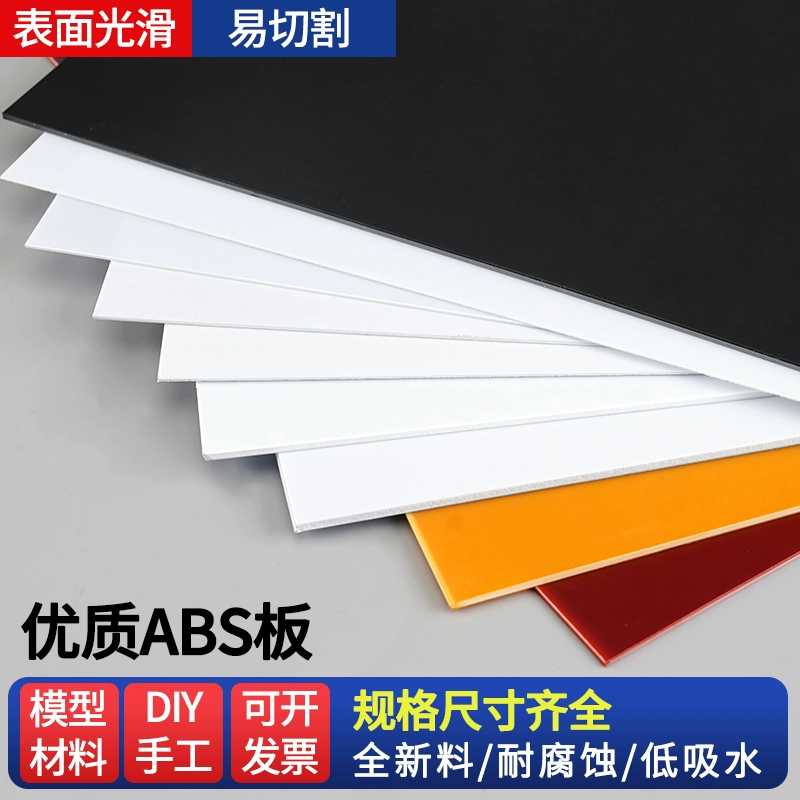
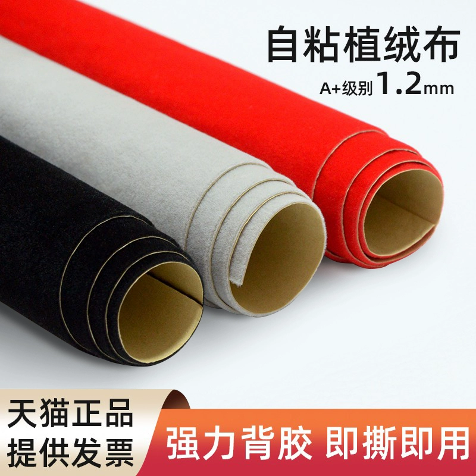
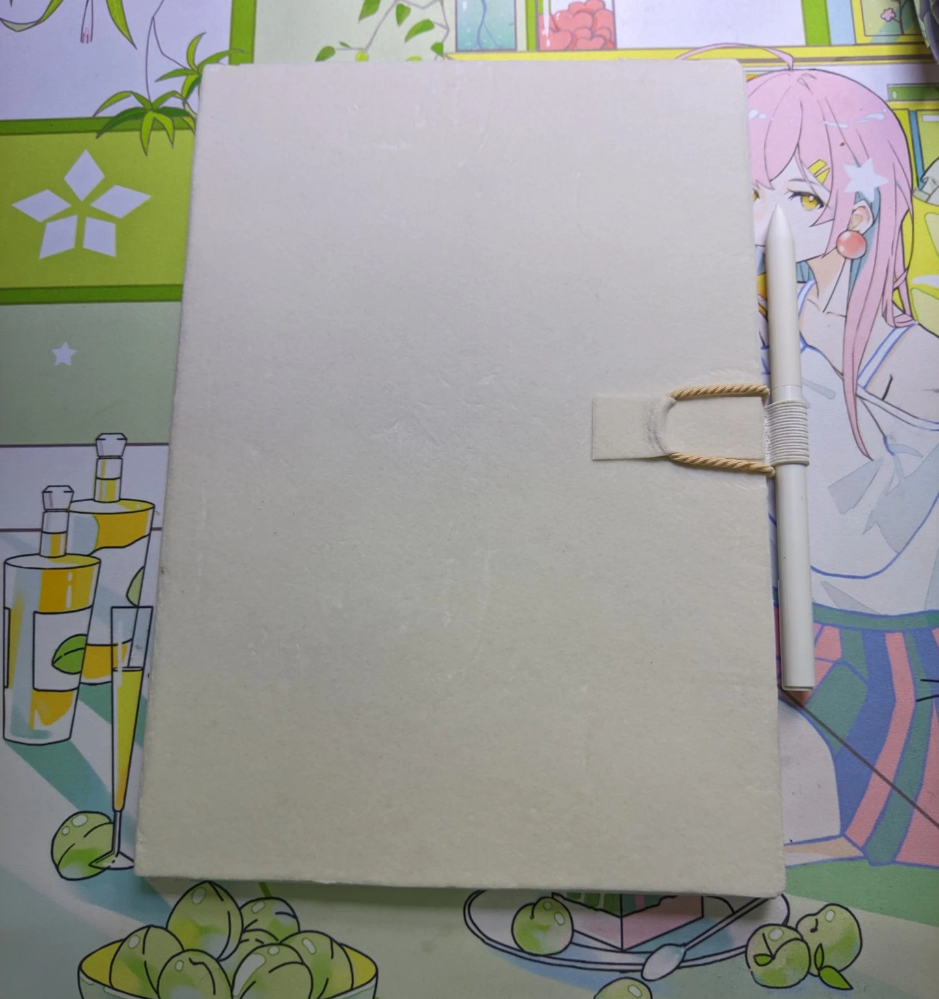
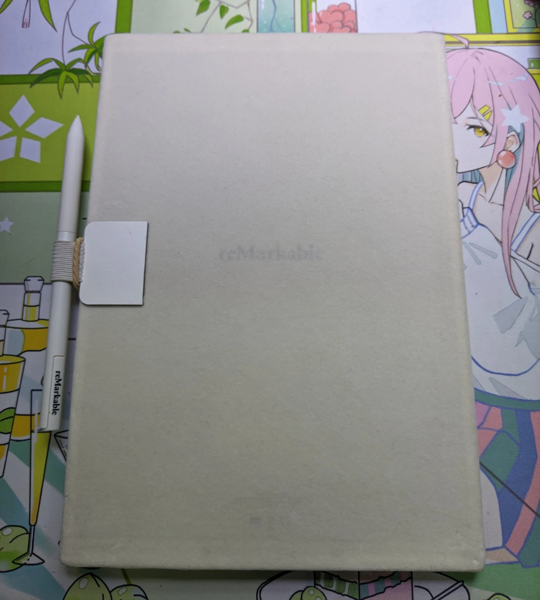
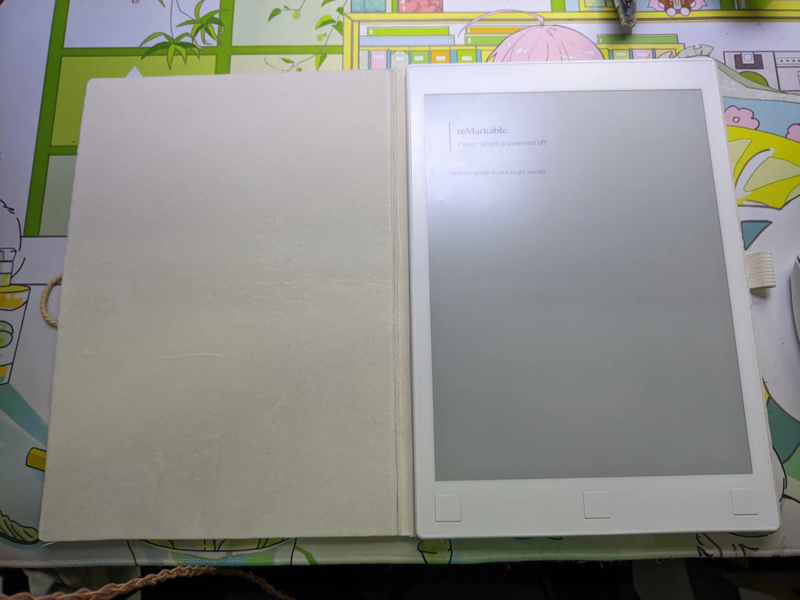

# 给reMarkable 1做的保护套

便宜实用手感好，避免屏幕被划伤（就是不耐脏？）

## 先换个电池

[来自ifixit的教程](https://zh.ifixit.com/Guide/reMarkable+Paper+Tablet+1+-+RM100++Battery+Replacement/138978)

## 需要的材料（图源淘宝）

一块方便切割的abs塑料板

一卷自带背胶的植绒布

## 制作保护套

1. abs 切成与reMarkable大小相同的长方形
2. 平整地贴在abs上，裁去溢出的部分
3. 将abs板盖在rmMarkable上，有植绒布的那面面对屏幕
4. 裁剪一块长度比reMarkable略大，宽度比reMarkable的两倍加上厚度略大的植绒布，将盖着abs板的reMarkable粘贴一圈

也就是说，把它们像这样粘在一起：（俯视图）

## 成果

还额外粘了一个笔插和一条皮筋用于固定翻盖

2025/04/12